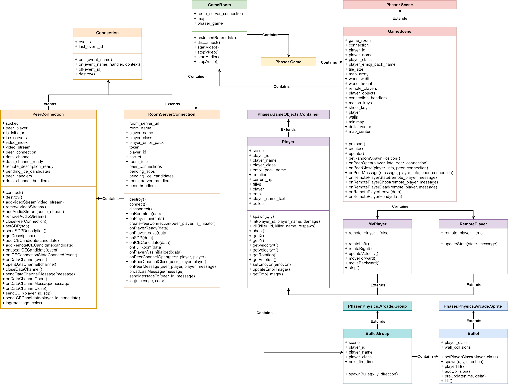

## Features

### Choose your hero

You can choose your hero and emoji pack, and join the room!


### Battle

The game is a multiplayer action game. Time to battle!


### Peer-to-peer WebRTC

Rooms are WebRTC peer-to-peer. Server is required only for the peer connection signalling and game files retrieval


### Video and audio sharing

You can share video and audio with your rommates


### Emotion recognition

If you share your video, your emotions will be recognized and your character's emoji will be updated


## How to run

Clone the repository first:

```
git clone https://github.com/Sarrasor/Triplemojio.git
```

I will refer to the folder with the repo as `Triplemojio`.

### Running locally 

If you want to run the game in development mode, you will need to have `NodeJS` and `npm` installed. If you don't have them, check out [this](https://docs.npmjs.com/downloading-and-installing-node-js-and-npm) link.

Open two terminals, and `cd` into the `Triplemojio` folder.

In the first terminal:

```
chmod +x run_local.sh
./run_local.sh
npm install
npm run game_server
```

In the second terminal:

```
npm run room_server
```

Now you can go to `https://localhost:8080`

### Running in Docker

If you want to deploy the game on your server, then go for Docker.

If you don't have Docker and Docker Compose on your machine, you will have to install it. Check out [this](https://docs.docker.com/compose/install/) link.

To check that you have Docker Compose installed:

```
docker-compose --version
```

It should give something like this:

```
docker-compose version 1.24.1, build 4667896b
```

Now you can deploy the game:

```
chmod +x run_local.sh
./run_local.sh
docker-compose build --no-cache
docker-compose up
```

### Ngrok tunnels

Ngrok allows you to expose local server to the world

Download ngrok from [here](https://ngrok.com/download) and unpack the executable to the `Triplemojio/ngrok` folder

Next, connect your Ngrok account. Add this line to the `ngrok_config.yml`:

```
authtoken <your auth token>
```

Run Ngrok tunnels:

```
chmod +x run_ngrok.sh
. ./run_ngrok.sh
```

Before running the server, you might want to receive a TLS certificate. If so, read the section below.


If all certificates are ok, run Docker:

```
docker-compose build --no-cache
docker-compose up
```

### Receiving Let's Encrypt certificate

Since modern browsers allow WebRTC video and audio only via HHTPS, you might want to create an HTTPS server. In order for an HTTPS server to work, you will need some TLS certificates

This script can automatically receive a Let's Encrypt certificate:

```
./get_certificates.sh
```

### Stopping Ngrok tunnels

Ngrok tunnels run in the background. If you need to stop it:

```
ps ax | grep ngrok
kill <ngrok pid from the previous command>
```

## Implementation info

Here you can find some impementation insights 

### Repository structure

- `game_server` - Game source code
	- `game_files` - game code
		- `game` - game field code
			- `assets` - game assets such as sprites and textures
			- `scripts` - game field scripts
				- `connections` - game networking scripts
				- `game_objects` - game classes
				- `models` - emotion recognition models
				- `emotion_recognition_config.js`
				- `game_config.js`
				- `main.js`
			- `styles` - game field css styles
			- `index.html` - game field page
		- `images` - images for the player selection page
		- `libs` - min.js versions of required libraries
		- `scripts` - player selection page scripts
		- `styles` - player selection page css styles
		- `404.html` - 404 page
		- `index.html` - player selection page
	- `nginx.conf` - config of the nginx static server
- `room_server` - Room Server source code
- `docker-compose.yml` - Docker compose with Game Server, Room Server, and Certbot services

- `get_certificates.sh` - script to receive Let's Encrypt TLS certificates
- `get_ngrok_tunnels.py` - Python script to get names of running Ngrok tunnels
- `ngrok_config.yml` - Ngrok tunnel configuration file
- `package.json` - npm package description
- `run_local.sh` - script to update configs to run the game locally
- `run_ngrok.sh` - script to update configs to run the game with Ngrok

### Physical view


### Class diagram


